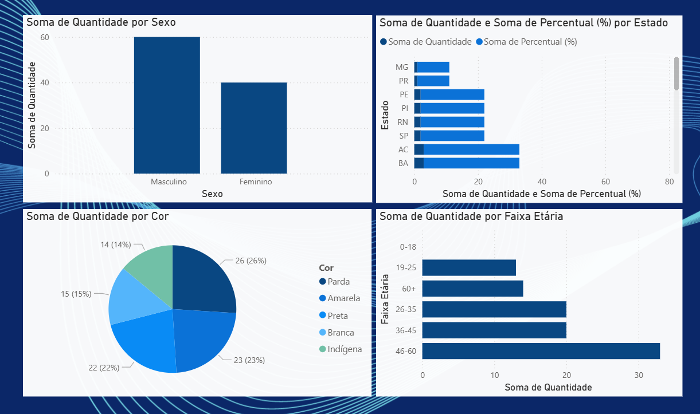

# 📊 Pandas & Power BI – Análise e Visualização de Dados

Este projeto demonstra como utilizar a biblioteca **Pandas** no Python para análise de dados e o **Power BI** para criação de dashboards interativos. A ideia é transformar dados brutos (ex: arquivos `.csv`) em insights visuais úteis.

<div align="center">
    
</div>

---

## 🐍 O que é o Pandas?

**Pandas** é uma biblioteca essencial do Python para **manipulação, limpeza e análise de dados**. Ele fornece duas estruturas principais:

* **`DataFrame`**: uma tabela de dados, como planilhas do Excel.
* **`Series`**: uma única coluna ou vetor.

### ✅ Com Pandas, você pode:

* Ler e escrever arquivos CSV, Excel, JSON, SQL, entre outros.
* Filtrar, agrupar, ordenar e transformar dados.
* Tratar valores ausentes, duplicados e inconsistentes.
* Calcular estatísticas descritivas (média, contagem, desvio padrão etc.).
* Realizar junções (merge/join) entre tabelas.
* Preparar dados para visualização ou machine learning.

### 🧪 Exemplo prático:

```python
import pandas as pd

# Lê um arquivo CSV
df = pd.read_csv('dados.csv')

# Visualiza as primeiras linhas
print(df.head())

# Filtra pessoas com idade acima de 30
df_filtrado = df[df['Idade'] > 30]

# Agrupa por sexo e calcula a média salarial
media_por_grupo = df.groupby('Sexo')['Salário'].mean()
```

---

## 📈 Power BI – Criando Dashboards com os CSVs gerados

O **Power BI** permite a criação de dashboards interativos e visuais com base nos arquivos gerados pelo Pandas, como `sexo.csv`, `etnia.csv`, `idade.csv` e `estado.csv`.

### 🚀 Passo a Passo:

#### 1. Instalar o Power BI Desktop

Se ainda não instalou, [baixe aqui o Power BI Desktop](https://powerbi.microsoft.com/pt-br/desktop/).

---

#### 2. Importar os arquivos CSV

1. Abra o Power BI.
2. Vá em **Início > Obter Dados > Texto/CSV**.
3. Selecione um dos arquivos (`sexo.csv`, por exemplo) e clique em **Carregar**.
4. Repita para os demais arquivos.

---

#### 3. Verificar os dados importados

* Acesse a guia **"Dados"** (ícone de tabela).
* Verifique os tipos de dados, como `Quantidade` e `Percentual (%)`.
* Se necessário, ajuste clicando no cabeçalho da coluna.

---

#### 4. Criar visualizações

##### 📊 Distribuição por Sexo

* Inserir um **gráfico de colunas**.
* `Sexo` no eixo X.
* `Quantidade` como valor.
* `Percentual (%)` como **tooltip**.

##### 🧬 Distribuição por Etnia

* Inserir um **gráfico de pizza**.
* `Cor` como legenda.
* `Quantidade` como valor.

##### 📅 Faixa Etária

* Gráfico de colunas com `Faixa Etária` no eixo X.
* `Quantidade` nos valores.

##### 🗺️ Distribuição por Estado

* Gráfico de barras horizontais.
* `Estado` no eixo Y.
* `Quantidade` nos valores.

---

#### 5. Personalizar e Interagir

* Use **segmentações de dados** para criar filtros dinâmicos.
* Formate cores, títulos e rótulos conforme sua identidade visual.
* Combine diferentes gráficos em um dashboard único.

---

#### 6. Salvar e Publicar

* Salve seu projeto como `.pbix`.
* Para publicar online, vá em **Início > Publicar** e selecione seu workspace no Power BI Service.

---

## 📁 Arquivos gerados

| Arquivo      | Descrição                                                |
| ------------ | -------------------------------------------------------- |
| `sexo.csv`   | Quantidade e percentual por sexo                         |
| `etnia.csv`  | Distribuição por cor/etnia                               |
| `idade.csv`  | Faixas etárias calculadas a partir da data de nascimento |
| `estado.csv` | Contagem de pessoas por estado                           |

---

## 🧠 Conclusão

Com Pandas + Power BI, você pode transformar rapidamente arquivos brutos em análises visuais poderosas. Isso é ideal para relatórios, dashboards corporativos e tomada de decisão baseada em dados.

---


